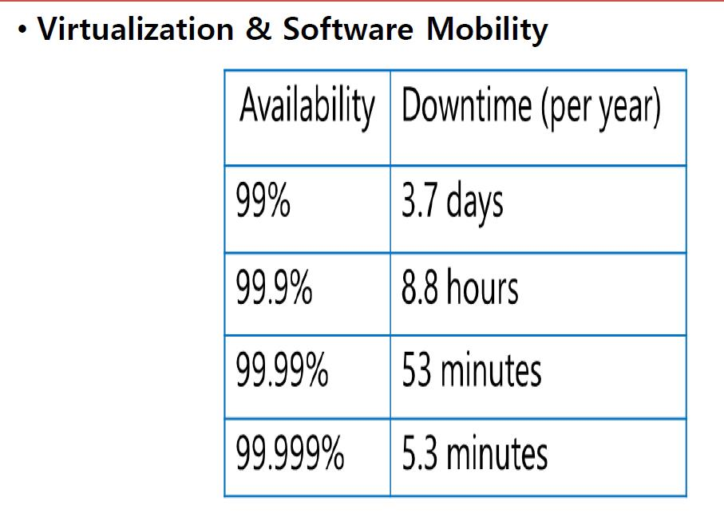

## Cloud 기초

### 1) Cloud Computing이란?

-`네트워크를 통해` 사용자가 다양한 It자원(Compute/Server, Network, Storage, Software)을 사용하     고 비용을 지불하는 컴퓨팅 환경.

-웹 브라우져를 통해  접속  

 대표적인 웹브라우져) Apple- Crome, Safri  / MS - Edge / Linux- 오페라, Firefox

   

### 1-1) Cloud Computing 특징

* Elastic : 신축성 있음

* Scalable: Datacenter의 리소스들이 하나로 풀링되어 있음 => 각 서버, 스토리지, 네트워크들을 가상화 (사용자가 많아지면 여러개의 서버로 확대되어 질수 있어야함. 확장가능함)

* On-Demand Self Service: 자신이 원하는 서비스를 만들고 사용 

* On-Premise 환경보다 운영관리 비용 저렴. 

   

### 2) Cloud Computing Models

### * Public , Private, Hybrid cloud 

* Public Cloud:  IT-Vendor  

   ex) Amazon,  Azure, Google (글로벌) /  KT, SK (국내)

  

* Private Cloud: On-premise(회사 내 네트워크 환경) 

  System Center가 회사내 각 서버를 중앙에서 관리하는 환경 

   ex) MS Window Server(2012,2016,2019), VM-Ware, Vspere(Esxi, VCenter) ,      OpenStack(Linux) 

  

* Hybrid Cloud: Private Cloud <-> Public Cloud  

  ex) 기아 자동차의 이벤트 시즌 : 일시적으로 많은 사용자들의 데이터를 받기 위해 Public Cloud이용 

### 3) Cloud Service Models

#### * IaaS PaaS Saas

* IaaS

  host (o/s부터 사용자가 관리)

  ex)  SQL in an VM ,  Window Server 2012 2016 2019

  

* PaaS

  build (개인 개발용) 

  ex) WordPress(Azure WebApp) , Azure SQL Database

  

* SaaS

  consume ( 개발이 이미된 서비스) 

  ex) Microsoft 365

### 4) 가상화 및 Clould기본 개념

### 

1) Availability Set (99..95%)

: 한 데이터 센터 내에서 lack 단위로 3개 복사

2)  Availability Zone ( 99.99%)

: 데이터 센터

* 1년 53분 Downtime 허용

