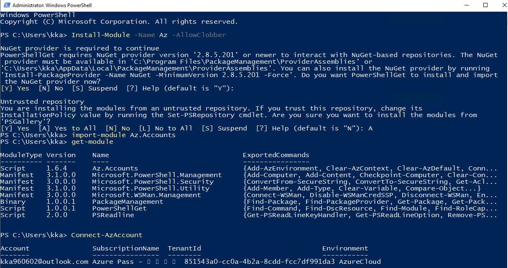
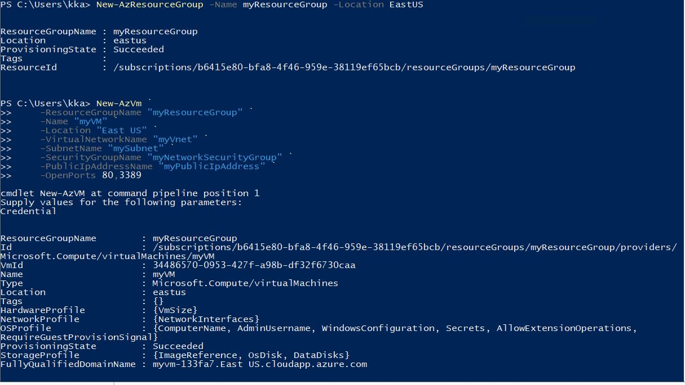
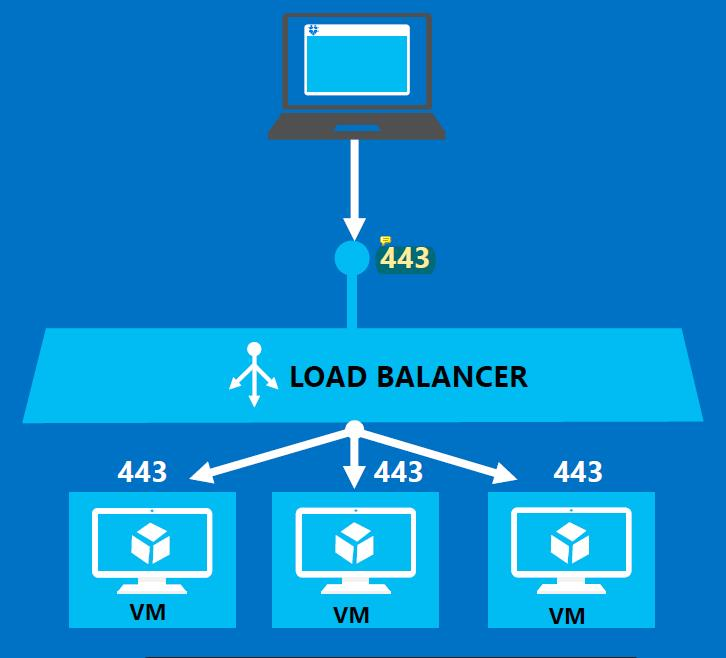

##  Module 2 : Microsoft Azure management tool ( CloudShell/ PowerShell/ Azure CLI)

### 1. Cloud Shell 

> Auzre Portal에서 사용할 수 있는 쉘 ( PowerShell, Bash)


### 2. Power Shell

#### 1) Az 모듈설치 

https://docs.microsoft.com/en-us/powershell/azure/install-az-ps?view=azps-1.8.0&viewFallbackFrom=azps-1.2.0


> window에서 사용가능한 쉘
>
> * 명령어가 길다.
>
> * 복잡하다.
>
> * Powershell ISE : powershell 명령어를 스트립트화 할 수 있다.
>
>   ​                             `console창과 script창이 있음`
>
> * Powershell Module : powershell 명령어들의 집합.
>
>   
>
>   > ```powershell
>   > get-command # 모든 명령어 모두 출력(동사-명사형태)
>   > 
>   > get-process # 현재 작업관리자 (사용 Cpu등 출력)
>   > 
>   > get-module # 각 모듈을 조회
>   > 
>   > Step1. Install-Module -Name Az -AllowClobber # Azure Module설치
>   > 
>   > Step2. import-module Az.Accounts # Azure Module등록
>   > 
>   > Step3. Connect-AzAccount # Azure에 접속
>   > 
>   > Step4. Get-AzSubscription # Subscription 확인
> >        Select-AzSubscription -Subscription <Subscription ID> 
>   > 
>   > ```
>   >
>   
>   
>
> ```powershell
> # Azure리소스 그룹 만들기
> New-AzResourceGroup -Name myResourceGroup -Location EastUS 
> 
>   # 가상머신 만들기 
>   # 인증창에 이름, 패스워드 지정
> New-AzVm `
>     -ResourceGroupName "myResourceGroup" `
>     -Name "myVM" `
>     -Location "East US" `
>     -VirtualNetworkName "myVnet" `
>     -SubnetName "mySubnet" `
>     -SecurityGroupName "myNetworkSecurityGroup" `
>     -PublicIpAddressName "myPublicIpAddress" `
>     -OpenPorts 80,3389 
>   
>     
> ```
>
> 


myVM 실행 후 설정해둔 이름, 패쓰워드 입력하면 접속된다!!!!


## 2. Azure CLI

> windows, Mac, Linux에서 사용가능한 쉘 
>
> * 명령어가 짧다.
>
> * 단순하다.
>
>   
>
> ##### 1) Azure CLI 설치
>
> https://docs.microsoft.com/en-us/cli/azure/install-azure-cli-windows?view=azure-cli-latestazure-cli-2.0.63.msi 
>
> 

​     **관리자 cmd로 들어가면 접속이 안된다. 

> ```shell
> step1. az  # Azure시작
> 
> step2. az login #Azure로그인
> 
> step3. az account list	# subscription출력
> ```


#####     2) 리소스그룹 만들기

> ```shell
> az group create --name myResourceGroup1 --location eastus 
> ```


#####      3) 가상 머신 만들기

> ```shell
> az vm create ^
>     --resource-group myResourceGroup1 ^
>     --name myVM ^
>     --image win2016datacenter ^
>     --admin-username azureuser ^
>     --admin-password Pa55w.rd1234    #내가 지정해둔 비번
> ```


##### 4) 웹트레픽(방화벽)에 대해 포트 80 열기

```shell
az vm open-port --port 80 --resource-group myResourceGroup --name myVM
```


##### 5) 가상머신에 연결

로컬 컴퓨터에서 만든 vm을 원격으로 띄운다.

```powershell
mstsc /v publicIpAddress #원격VM DNS name입력후 원격접속
```


##### 6) 웹서버 설치

실제로 작동하는 VM을 보려면 IIS 웹 서버를 설치합니다. VM에서 PowerShell 프롬프트를 열고 다음 명령을 실행합니다.

```shell
Install-WindowsFeature -name Web-Server -IncludeManagementTools
```


## 3. NAT

* Network Address Translation
* 내부망을 외부망으로 나가기 위해 사설ip를 공인 ip로 바꿔주는 것


## 4. Load Balancer (Module 5)




* Probe: Backend Pool에 있는 Vm들이 정상 동작하는지 확인 (상태 정검)


