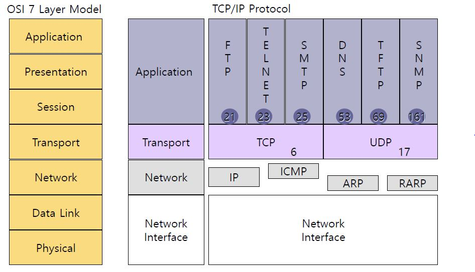
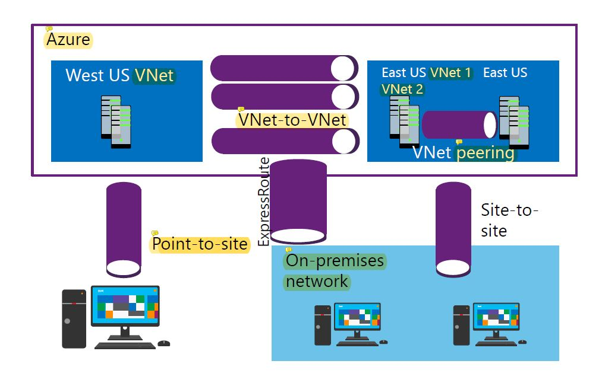

## Module 5 : Implementing and managing Azure networking

### 1. Network 기초

#### 1) what is Network?

* peer to peer 환경 (Client가 Server가 될수 있고, Client가 Server가 될수 있음)

* client / server 환경 (서버를 별도로 배치)

  client : 서비스를 요청하는 쪽(request) / server : 서비스를 응답하는 쪽 (response)

  

  #### 2) 특징

* 하드웨어 공유

* 컴퓨터간에 파일 및 디렉터리

* 공유

* 전자메일 등 커뮤니케이션 지원

* 전자뉴스나 www에 의한 정보 공유

* 그룹 웨어를 이용한 사내 협업작업

* 원격지에서 비디오 화상회의 시스템의 사용

#### 3) 스위치

#### 4) OSI 7계층

> 1) 물리 계층
>
> * 랜 케이블, 광 케이블, 동축 케이블을 위한 계층
>
> * 대표 장치 : HUB
>
> * 데이터 전송 단위 : Bit (비트 스트림)
>
>   ​	
>
> 2) 데이터링크 계층
>
> * 노드간에  상호통신에서 오류제어, 흐름제어함

> * 대표장치 : 스위치, 브리지, MAC Address
> * 데이터 전송 단위 : Frame(프레임) 
>
> 3) 네트워크 계층
>
> * 주소(목적지)를 찾는 역할
> * 라우터, IP, ARP, ICMP, IGMP
> * 데이터 전송 단위 : packet(패킷)
>
> 4) 전송 계층
>
> * TCP : 신뢰성 데이터 (3 way handshake : 데이터를 잘 받았는지 3번 확인함)
> * UDP : 비신뢰성 데이터 (확인을 안함, 전송속도가 빠름)
> * 데이터 전송 단위 : segment(세그먼트)
>
> 5) 세션 계층
>
> * 세선 연결, 관리,종료 / 동기화
>
> 6) 표현 계층
>
> * 압축과 암호화를 담당
>
> 7) 응용 계층

#### 5) TCP /IP protocol

#### 6) IP Address 

인터넷 상에서 목적지를 찾는 주소체계. 32Bit로 구성(43억개 만들수 있음)

IPv4 => 32bit, IPv6 => 128bit(2^128)

* IP = Network ID( 우편번호, 회사) + Host ID(번지, 회사내의 각각 장치)
* Subnetmask : 네트워크 ID를 식별

1) A Class : N H H H (255.0.0.0)  

* 범위 : 1.0.0.0 ~ 126.255.255.255 

* Network수 : 2^7-`2`=126개

* Host수 : 2^24-`2`=16777214개

  * Network수 2를 뺴는 이유 : 0 (네트워크를 식별할 때 사용) , 127(Loopback IP 모               든 컴퓨터에 셋팅되어 있음)

  * Host수 2를 빼는 이유 : Host의 모든값 0(Network ID 식별) , 1 (Broadcast IP)

    

2) B Class:  N N H H(255.255.0.0)

* 범위 : 128.0.0.0 ~ 191.255.255.255

* Network수 : 2^14

* Host수 : 2^16-2

  

3) C Class: N N N H (255.255.255.0)

* 범위 : 192.0.0.0 ~ 223.255.255.255
* Network수 : 2^21 
* Host수 : 2^8-2

4) D Class : 멀티캐스트 데이터 전송시 사용

5) E Class : 예약 IP,  군사용

#### 7) 데이터 전송방식

* Unicast (1:1통신)

   A~C class 

* Multicast ( 1:그룹통신)

  ex) 인터넷방송(1개의 데이터를 M개로 뿌려지는 통신)

* Broadcast(1:모든통신) 

  라우터 안(회사안) 모든 장비에 뿌려지는 통신

#### 8) Load Balancers (부하분산처리기)

* Azure Load Balancer( Layer 4 )

  같은 데이터 센터끼리만 가능

* Application Gateway (Layer 7)

   다른 데이터센터끼리 가능 ( 같은 데이터센터도 가능함)

* Traffic Manager(DNS-based)

### 

#### 9) CIDR표기법

사용이유 : Class로 ip를 부여해줄 경우 IP낭비가 심하기 때문

* Class : 10진법으로 표기 => ip낭비가 너무 심함 

  ex) 2000개의  Ip가 필요하면 B class를 사용해야됨. 즉, 63536개 낭비 

* CIDR : 2진법으로 표기

  **Q) 2000개 Host가 필요할떄 알맞은 SubnetMask를 CIDR표기법?

#### 10 ) Subnetting

isp에서 부여받은 네트워크 ID로 더 작은 subnet으로 분할하여 사용

#### 11) VLSM

`Various Length Subnet Mask`

 Host수에 따라 Subnetting, Submask값이 다르게 부여. 

**반드시 많은 수를 먼저 Subnetting 해야됨!

ex) 인사부 (100개) , 관리부(60개), 제조부(30개), 영업부(10개)

### 2. Azure Virtual Network

#### 1) what is Azure Virtual Network ?

* 자동화되는 라우팅을 사용

* 사용자가 원하는 도메인 이름(DNS name) 사용가능

* TCP, UDP, ICMP를 지원함

* 1개 이상의 IP 서브넷으로 나눌수 있다. 

  

  #### 2) IP 할당 방법 

  사설 IP를 주로 씀 (Vnet에 일반적으로 할당)

  * private ip : 10.0.0.0 ~ 10.255.255.255

    ​                     172.16.0.0 ~ 172.31.255.255

    ​                     192.168.0.0 ~ 192.168.255.255

  * public ip : 그 외 

    *Azure에서 10.10.0.0/16 (1~3는 Azure가 고정예약해둠) 

  #### 3) IP Subnets

  * 29bit까지 Subnet Mask사용
  
    `*원격 : RDP(3389) , MS-SQL: TCP(433), Web서비스 : port(80) 을 열어주기`
  
  #### 4) DNS name
  
  * Default - Azure 에서 기본적으로 제공됨(너무 김) 
  
  * Custom - AD(Active Directory)에서 MX, TXT record가 할당되어야 한다.
  
    ​               - 구입한 Domain과 연동시켜줘야한다.
  
  #### 5) VPN (Virtual Private Network)
  
  -기본적으로 사설 ip 할당 
  
  Azure에서 10.10.10.0/24 (1~3는 Azure가 고정예약해둠)  =>254-3= 251개 사용가능
  
  -원격으로  집 <-> 회사내 네트워크로 접근할 수 있는 터널링하는 네트워크
  
  * 터널링기술
  
    1) PPTP 
  
    ​    사용 잘 안함
  
     2) L2TP / IPSec
  
    ​     암호화 기술 
  
     3) SSTP 
  
    ​    TCP Port(443) 1개만 사용  (자동 암호화)
  
     4) IKEv2 
  
       -세션을 서버에서 자동 접속 (가장 최신 버전)
  
       -접속이 끊겨도 서버에서 자동 연결
  
  * VPN 종류
  
    
  
    1) P2S (Point to Site) VPN
  
    ​    사용자가(개인) VPN으로 Azure VNet으로 접속.
  
    ​    *`반드시 연결 셋팅을 해줘야함`
  
    
  
    2)  Site to Site VPN
  
    ​     회사(On-Premises network)라우터 장비와 Azure VNet과 접속
  
      *`연결 셋팅 해줄 필요가 없음` 
  
    
    
  3) VNet to VNet VPN
    
  ​    다른 데이터센터의 Azure VNet과 접속
    ex) West US VNet <-> East US VNet1
  
    
  
    4) VNet peering 
    
    ​    같은 데이터센터안에 있는 VM끼리 접속
    
    ex) East US VNet1 <-> East US VNet2
    
    
  
  #### * Ping 명령어
  
  ICMP로 네트워크 접속 확인
  
  
  
  #### * Wf .msc 명령어
  
  고급 방화벽 열어주는 기능
  
  
  
  #### * Netstat -na 명령어
  
  사용자와 목적지 컴퓨터와 통신여부. 
  
  현재 어떤 포트가 열려있는지 확인 가능.
  
  
  
  #### * Port
  
  데이터가 전송되는 통로 
  
  1) TCP 80 : 웹 (http: 암호화 X) 접근
  
  2) TCP 443 : 웹 (https : 암호화 0 ) 접근
  
  3) TCP 3389(RDP:Remote Desktop Protocol) : Window Server 원격 접근
  
  4) TCP 22 : SSH (암호화 지원)
  
  5) TCP 23 : Telnet (암호화 지원안함)
  6) TCP 445 : SMB 3.0 공유폴더에 접근
  
  7) TCP 1433 : SQL
  
  
  
  
  
  

