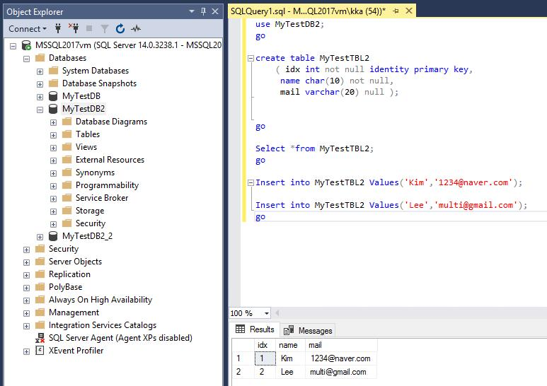

## Module 6 (190979E) : Introduction to Azure Storage and Data Service(SQL) 

#### * ARM (Azure Resource Manager) 

  Azure에서 제공하는 7가지 서비스 (10979E 참고)

### 1) Azure Storage 

*storage account가 반드시 있어야 각 storage 접근가능

* Blob(Container) Storage

  -Container: 객체를 관리하는 단위

  ex) DB(table, Index, 함수..), Folder(파일), Zone(dns)

  -Blob(Container) Storage : blob data를 저장하는 저장소

  * Hot (Page blobs)

    -랜덤 접근 최적화(실시간 접근)

    -Vm disk file에 최적화

    -요금이 cool보단 비싸나 cool로 하고 접근을 빈번하게 할 경우 과금부가

  * Cool (Block blobs)

    -가끔 접근

    -ISO, 백업 데이터

  * Append blobs

    -로그 데이터

    

* Table Storage

  NoSQL사용

  Key/Value(값) 로 저장(아스키형태)이며 주로 IOT구축할때 주로 사용

  

* Queue Storage

  메일/ 알람 셋팅할 때 사용

  

* File Storage

  SMB3.0, SMB2.1을 통해  Azure공유폴더에 바로 접근

  

### 2) Storage 환경 구축

* SQL Server 설치

  https://www.microsoft.com/ko-kr/evalcenter/ (server 2014 ISO 평가판다운)

* Azure Storage Explorer 설치

  https://azure.microsoft.com/ko-kr/features/storage-explorer/ 

  * .Net Framework 4.8

    	https://dotnet.microsoft.com/download/dotnet-framework/net48?utm_source=getdotnet&utm_medium=referral
    	
    	

* Azure Storage/ Azure Storage Explorer 사용하기

> 1) Storage Account 생성 (Azure Portal)

-Account kind 설정 : StorageV2(최신버전)

-Replication 설정 : LRS(Locally-Redundent Storage) //하나의 데이터센터내에 3개 복제

​                                GRS(Geo-Redundent Storage) //쌍으로 지역에 복제 

> 2) Container Storage 사용

* Container (`그 외 Table, Queue, File`) 생성

​        -share container생성(private) :  share container 안에서 파일 관리 및 업로드 (폴더 생성 가능)

​       *But! Azure Storage Explorer가 Azure Portal 보다 업로드하고 관리하기 쉽다. 

* 각 파일 url 복사후 브라우져에서 열기 가능

* Generate SAS token 만들기 (공유용)

​     token정보를 아는 사용자만 접근가능, 접근 

​	-Permission 지정

​    -Allowed protocol (접근허용 IP 지정) 

* Access Key 자동 할당

​      Key값 2개 생성. Java 등 개발하면서 azure storage에 접근 할 수 있게 함.

> 3) File Storage 사용

* File Storage생성

​    -name, quota(GIB)지정

* Azure Storage Explorer에서 Connect VM( URL생성 )

​     - URL 복사 (드라이브 지정)

​    -  cmd창에서 복사한 url넣고 드라이브 지정 (local에서는 방화벽 때문에 생성불가)

* 상대방 Share 폴더 접근 가능

  공유포트 TCP 445 오픈

  *공유포트(SMB3.0)

  -TCP 445,139 

  -UCP 138,137

## 3) SQl 환경 

#### 1) Azure SQL (=DBaaS)

* PaaS 서비스 (사용자 DB만 사용가능)

* 종류

  * Azure SQL Database

  * Azure Database for MySQL

  * Azure Database for PostgreSQL

    

#### 2) SQL in an Azure VM 

* IaaS 서비스

* 종류

  * SQL Server in an Azure VM

  * MySQL in an Azure VM

  * PostgreSQL in an Azure VM

  * 다른 RDBMS

     ex) DB2, Oracle DB, SAP ASE, SAP HANA

#### 3) SQL in an Azure VM 환경 구축 (IaaS)

SSMS(SQL Server Management Studio)가 관리. `Window Server내에서만 설치 가능`

1) Azure portal에서 SQL Server 2017 Enterprise Window Server 2016 생성

*일반적으로 Cpu 8개 , 56Gib memory 사용

2) ip-configuration 설정 (DNS name설정)

3) SQL VM연결 

  `일반 VM 과는 다르게 SQL이 내장되었음.`

4) SQL Server Management Tools 17 실행

`VM안에 SQL이 이미 내장되어 있음`

5) New Query 후 Database 폴더 생성, Table 생성,  name과 email index값 넣기.

* MYTestDB[Property-Option-Korean Wansung] 한글설정 가능

  

#### 4) SQL Database구축 (PaaS)

SSMS(SQL Server Management Studio)가 관리.

* connection strings 기능

  

개발시에 DB에 연결하여 사용.

* Firewall(방화벽) 설정

  나의 db에 지정한 ip만 접근하도록 등록(고정) [Overview-Set server firewall] 

* Connect to Server

  -server name (자신의 db-server name url복사후 입력)

  -authentication : SQL Server Authentication / Window Authentication

  