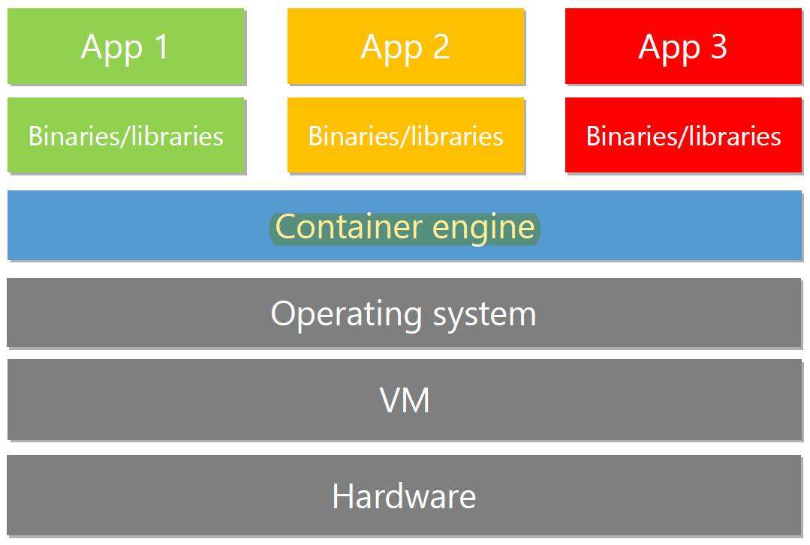

## Module 7 : Introduction to Container(=Docker) and Serverless Computing in Azure

### 1) What is Container?

메모리에서 실행되고 있는 상태?

#### 2) Container 구조

* App을 사용하기 위해 필요
* 하드웨어 리소스를 공유
* ex) Window / Linux Container engine 보유 (VM이 사라지는 추세)

### 3) 용어

* Docker Engine
* Image
* Container
* Docker File
* Docker Registry : Image를 담고있는 장소
  * docker login 
  * docker pull
  * docker tag
  * docker push
  * docker pull or run
  * docker rmi/rm : 컨테이너 삭제