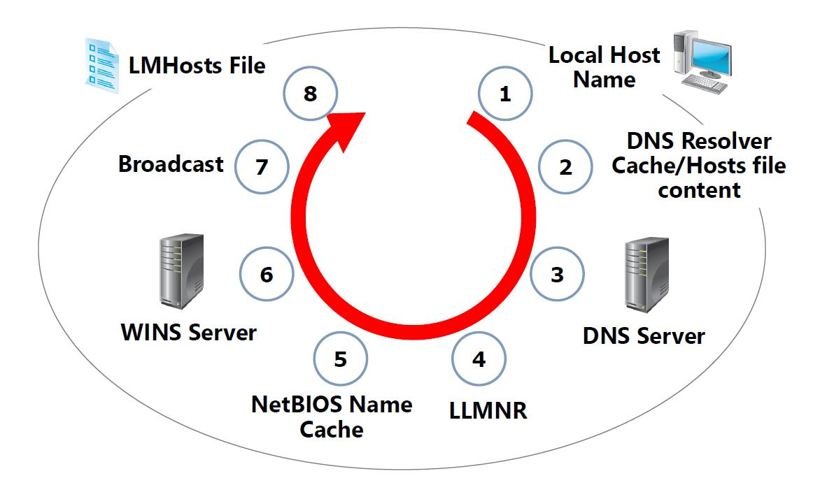
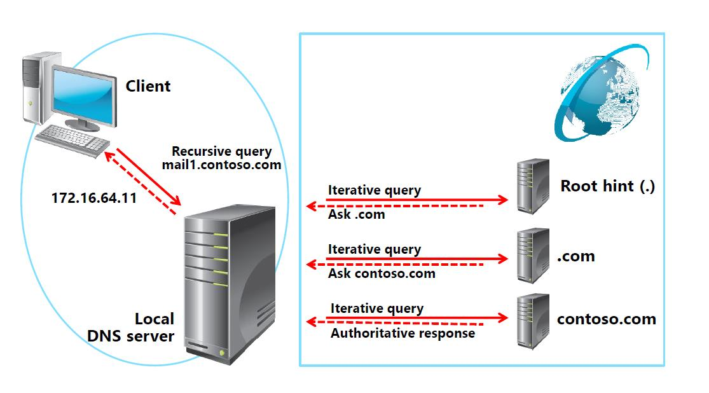

## Module 8 : Azure Active Directory & Azure DNS

## <Azure Active Directory>


## 1. Active Directory (AD)

* Ms Directoty Service
* -x.500(Directory Service 표준)
* Domain : 하나의 보안단위
  * SSO(Single Sign On) : 한번의 인증으로 계정 사용
  * 중, 대규모 네트워크 환경
  * DC(Domain Controller) 에서 인증 및 허가를 받는다.
  * 중앙화된 관리(GPO)

#### * Authentication (인증) : 등록된 사용자인지 아닌지 확인

#### *Authorization(허가) : 어떤 권한을 부여할지 결정

#### *Credential (ID + Password) : token SID 할당

* Work Group (ex)현재 멀캠 pc

* 각각의 시스템이 보안단위 

* 소규모 네트워크 환경에서 사용(20대 미만)

* 각자의 시스템에서 인증처리

  SAM에서 인증(계정 추가 가능)


## 2. AAD 종류

#### 1) ADDS (Active Domain Directory Service)

인증과 허가하는 서비스

#### 2) AD LDS (Active Lightways Domain Services)

Directory 서비스의 간략한 정보 포함

#### 3) ADCS(Active Directory Certification)

인증서 배포

#### 4) ADRMS (Active Directory Right Management Service)

권한 관리

#### 5) ADFS (Active Directory Right Management Service)

Fedoration협정을 맺은 회사 끼리 따로 인증을 하지않아도 바로 접속이 가능하다.


## <Azure DNS>

## 1. DNS란? 

전체컴퓨터이름 (FQDN)을 IP Address로 변경하는 방법

ex) www. kbs.co. kr(FQDN)

​     kbs.co.kr (DNS)


## 2. DNS Record 

* Type

  * SOA : 권한의 시작

  * NS : (Name Server) 지정

  * A : Host name => IPv4 Address

  * CName : Host name을 다른 Host Name 으로 매핑

  * SVR : Servcie의 위치정보를 알려줌

  * PTP : IP Address -> Host name 으로 매핑

  * AAAA : Host name => IPv6 Address로 매핑

  * TXT : 특정서버를 지정

  * MX : 매일서버를 지정

    *Azure Active Directory에서 자신의 회사도메인을 적용하기 위해 필요한 DNS Record :  TXT, MX


## 3. DNS 역할 

* Host이름 -> IP주소로 알려줌
* IP 주소 -> Host이름으로 알려줌
* 메일 서버


## 4. DNS Zone

* Forward lookup zone : Host 주소로 IP주소를 알려줌
* Reverse lookup zone : IP주소로 Host주소를 알려줌


## 5. Name Resolution (이름풀이)




Client 가 요청 -> Client resolver의 cache / hosts file을 먼저 조회 -> 둘 모두에 없으면 TCP/IP 설정할 때 지정한 DNS 서버에게 요청 -> IP 풀이 결과 받음


```bash
ipconfig / displaydns #DNS의 캐시를 열람 
                       #캐시(cache) : 서버 부하를 줄여줌, 부정확한 값을 받아갈수 있음.
                       
ipconfig /flushdns #캐쉬내용 삭제                      
```


## 6. DNS Query?



* Recursive Query 

  Client -> Server로 보내는 Query (정확하고 완전한 답변을 원함)

* Interactive Query

  참조하는 query

