# Data Analysis Project

## 항공 뉴스 기사 토픽 모델링(LDA)  및 항공 운항 현황 비교 분석

### Part.1 프로젝트 수행 배경 및 목적

현재 중심 이슈인 "코로나19" 가 크게 영향을 미치는 산업이 항공산업.

과연 현재 항공관련 뉴스 기사에 관한 토픽을 가진 기사가 얼마나 많을까? 또한 항공운항 현황에 어떠한 영향을 미치고 있는가"의 물음 가지고 프로젝트를 진행하였습니다. 

"KIS(한국신용평가) 당사는 스페셜 리포트를 통해 코로나 19확산으로 부터 가장 직접적이고 즉각적인 영향을 받는 주요산업은 항공산업이다. 중국과의 밀접한 경제관계 및 인적 교류 상태를 감안할때, 부정적인 파급효과가 불가피하다."라고 설명하였다.

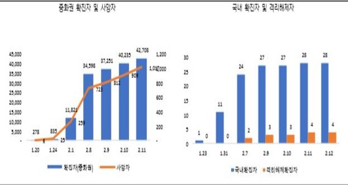

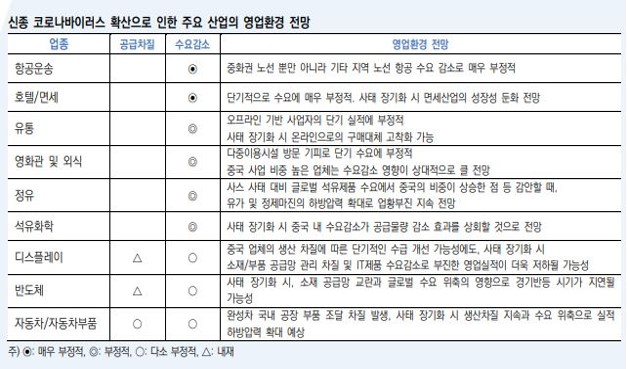

[출처: KIS 한국신용평가 Special Report ]

이러한 근거를 바탕으로 다음과 같은 목적을 가지고 프로젝트를 진행하였습니다.

-과연 현재 항공관련 뉴스기사에 코로나 관한 토픽을 가진 기사가 얼마나 많은가.

-항공운항현황에 어떠한 영향을 미치고 있는가.


### Part.2 프로젝트 구성

#### 1단계: 데이터 수집

* Beautifulsoup을 이용한 Web Crawler제작
* Web Crawler를 이용한 Never News Text Data 수집
* Airportal의 항공운항통계 open data 수집

#### 2단계: 데이터 전처리

* 한글을 제외한 문자 제거(특수문자, 영문, 숫자등)
* 불필요한 문자 제거
* 공백제거
* Stopword(불용어) 제거
* Tokenization(형태소 분석): 명사추출(Mecab모듈 사용)

#### 3단계: 데이터 탐색

* 시기별(1주 단위) 뉴스기사의 주요 단어 도출 및 시각화
* Gensim 토픽 모델링 (LDA) : 시기별 뉴스기사의 주요 토픽 찾기 및 시각화
* 항공운항현황 데이터 탐색 및 시각화


### Part.3  Topic Modeling (LDA) 개념적 배경

토픽 모델링이란 문서의 집합에서 토픽을 찾아내는 프로세스이다.

K개의 토픽을 Input 값으로 지정하고, K개의 토픽에 대한 단어의 확률분포를 베이지안 확률로 적용한 소프트 클러스터링 기법 중 하나라고 볼 수 있다. LDA의 생성 원리는 Generative한 글쓰기 방식이다. 우리가 글을 쓸때 토픽을 먼저 생각하고 그 토픽에 속하는 단어들의 조합으로 글을 작성한다.

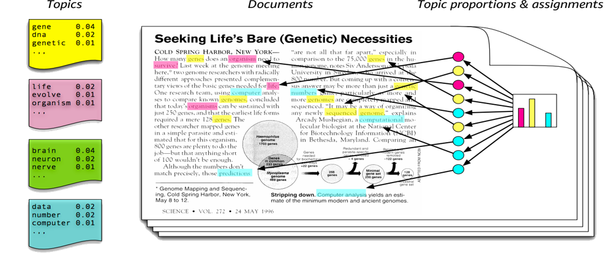

 대표적인 토픽모델링 알고리즘에는 LDA(Latent Dirichlet Allocation), ATM(Author Topic Model), DTM(Dynamic Topic Model)등 다양한 알고리즘이 있지만 글쓴이는 보편적이며 성능이 괜찮은 LDA모델을 사용하였다.

 

[LDA 모델 생성 과정]

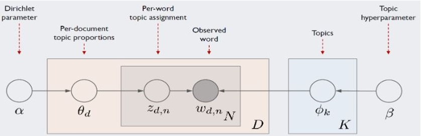

LDA모델 과정을 간략히 설명하자면,

* 어떤 문서에 대한 문서당 토픽분포를 가진다.

* 앞에서부터 단어를 하나씩 채울 때 마다 문서당 토픽 분포로부터 하나의 토픽을 선택

* 다시 그 토픽으로부터 단어를 선택하고 다시 앞에서부터 (단어를 채우고 하나의 토픽 선택)하는 방식으로 문서 생성 반복

* 즉, 단어를 차례차례 관측하며 단어의 토픽 분포 Zd,n을 갱신하고 Θ,Φ의 디리클레 분포를 갱신 

  

  <모델 알고리즘 설명>

  * 알파값은 디리큘레 확률분포(사전 확률)

  * 알파값은 세타값에 영향을 주며 전체 문서(D) Notation 안의 세타는 문서별 토픽 확률 분포를 가진다.

    (문서의 개수 만큼 반복)

  * 세타를 가지고 제트(단어별 토픽 확률분포)를 구한다. 

  * 반대뱡향에 존재하는 베타값(사전확률)으로 K(토픽의 개수)안의 파이값인 토픽별 단어 확률을 구한다.

  * 결국, 제트값과 파이값을 가지고 더블유(관측된 단어)를 추정한다.


### Part.4 데이터 수집

| 데이터                  | 항공 관련 네이버 뉴스기사                                    |
| ----------------------- | ------------------------------------------------------------ |
| 기간별 데이터 수집 기간 | 국내 코로나 사태 전 후(2020.01.06-2020.03.01 1주 단위기간별) |
| 데이터 규모             | 총 약 8484건의 데이터 (Naver News)                           |
| 데이터 수집 방법        | Python 언어                                                  |
| 데이터 수집 요소        | 뉴스기사의 제목, 언론사, 기사 링크, 네이버 기사 내용 전문    |

#### Naver News Web Crawler(beautifulsoup)

beautifulsoup 모듈을 이용해 네이버 뉴스기사를 원하는 날짜(크롤링할 시작 날짜-끝날 날짜)와 최대페이지수를 입력하면 크롤링할 수 있는 크롤러를 제작하였다.

```python
from bs4 import BeautifulSoup
import urllib.request
import requests
import pandas as pd
import re

#각 크롤링 결과 저장하기 위한 리스트 선언 
title_text=[]
source_text=[]
url_list=[]
content=[]

#엑셀로 저장하기 위한 변수
RESULT_PATH ='C:/Users/student/Downloads/project/'  #결과 저장할 경로

def crawler(maxpage, s_date, e_date):
    print("maxpage:{0}, s_date:{1}, e_date:{2}".format(maxpage,s_date,e_date))
    s_from = s_date.replace(".","")
    e_to = e_date.replace(".","")
    page=1
    
    maxpage_t =(int(maxpage)-1)*10+1 #최대페이지 : 5 , maxpage_t: 41
   
    while  page <= maxpage_t : #while문을 돌며 &start=1,11,21,31,41(페이지 이동)  
        URL="http://search.naver.com/search.naver?&where=news&query=항공%2B인천공항&sm=tab_opt&sort=0&photo=0&field=0&reporter_article=&pd=3&ds=" + s_date + "&de=" + e_date + "&nso=so%3Ar%2Cp%3Afrom" + s_from + "to" + e_to + "%2Ca%3A&start=" + str(page)
        #print(URL) URL에러 : https -> http
        
        response= requests.get(URL)
        html=response.text
        soup=BeautifulSoup(html, "html.parser")

        #제목 추출
        atags = soup.select('._sp_each_title')
        for atag in atags:
            title_text.append(atag.text) #제목

        #신문사 추출
        source_lists = soup.select('._sp_each_source')
        for source_list in source_lists:
            source_text.append(source_list.text) #신문사

        #기사 링크들
        for href in soup.find_all("dd", class_="txt_inline"): 
            content_link=href.find("a")["href"]
            url_list.append(content_link)
            
        page+=10
    
    for url in url_list:
        get_text(str(url))  #각 링크 안 기사내용 추출(함수 호출)  
       
    
    df = pd.DataFrame({
        "title": title_text , 
        "source" : source_text,
        "links": url_list,
        "contents": content })   #엑셀파일로 저장하기 위한 dataframe로 변환작업
        
    print("Df : ", df)
        
    #dataframe을 excel파일로 저장
    outputFileName = '%s - %s.xlsx' % (s_date, e_date)
    df.to_excel(RESULT_PATH+outputFileName,sheet_name='sheet1')
    
#기사 내용 추출
def get_text(URL):
    print(URL)
    text= ""
    if(URL != "#"):
        source_code_from_URL=urllib.request.urlopen(URL)
        soup=BeautifulSoup(source_code_from_URL,"lxml",from_encoding="utf-8")
        for item in soup.find_all("div", id="articleBodyContents"):
            text=text+str(item.find_all(text=True)).strip() #텍스트만 추출          
    return cleaning_text(text)

#데이터 전처리 
def cleaning_text(text):
    cleaned_txt=re.sub("▶\s*.+","",text)
    cleaned_txt = re.sub("[^ㄱ-ㅎㅏ-ㅣ가-힣 ]", "", cleaned_txt) #한글을 제외한 문자 제거
    cleaned_txt=re.sub("\s+", " ", cleaned_txt) #공백 제거
    
    #불필요한 단어 제거
    cleaned_txt=re.sub("[가-힣]{1,3}\s*기자", "", cleaned_txt) #김진형기자, 김진형 기자 .. 제거
    cleaned_txt=re.sub("[가-힣]+\s*뉴스", "", cleaned_txt) 
    cleaned_txt=re.sub("본문 내용", "", cleaned_txt)
    cleaned_txt=re.sub("플레이어", "", cleaned_txt)
    cleaned_txt=re.sub("오류를 우회하기 위한 함수 추가", "", cleaned_txt)
    cleaned_txt=re.sub("[가-힣]*뉴시스[가-힣]*", "", cleaned_txt)
    cleaned_txt=re.sub("세상을 보는 눈 세계일보", "", cleaned_txt)

    content.append(cleaned_txt)
    return content   

def main(): 
    maxpage= input("최대 크롤링할 페이지 수를 입력하시요: ")
    s_date = input("시작날짜 입력(2020.02.22)")
    e_date= input("마지막날짜 입력(2020.02.29)")
    crawler(maxpage,s_date,e_date)

if __name__ == '__main__':
       main()   
```

[2020.02.24-2020.03.01(1주단위) Naver News 기준]

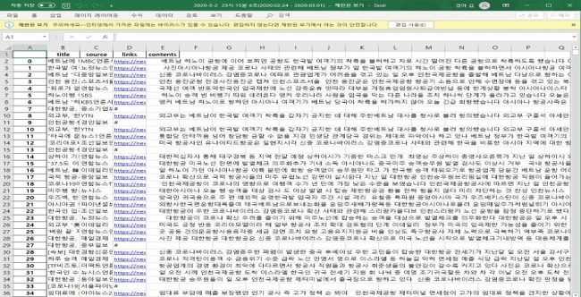

위와 같이 기사 제목, 언론사, 링크, 기사 내용순으로 크롤링한 내용이 엑셀로 저장된것을 확인할 수 있다.

### Part5. 텍스트 전처리

**본 텍스트 전처리와 분석은 시기별 일자[2020.02.24-2020.03.01(1주단위) ] 하나에 대한 분석 내용입니다.**

#### 5.1 불용어 제거 

```Python
def define_stopwords(path):
    
    SW = set()
    
    with open(path) as f:
        
        return SW 
```

#### 5.2 토큰화(Mecab)

Window MeCab사용을 위해선 konlpy 설치와 MeCab 설치가 필요하다.  Mecab 과 Knopl설치는 

https://cleancode-ws.tistory.com/97 블로그를 참고하여 설치하였다.

```python
#mecab객체생성
import MeCab
mecab = MeCab.Tagger()

import re

def nouns(text): #명사추출 함수
    nouns=[]
    pattern=re.compile(".*\t[A-Z]+")
    temp = [tuple(pattern.match(token).group(0).split("\t")) for token in mecab.parse(text).splitlines()[:-1]]

    for token in temp:
        if token[1] == "NNG" or token[1] == "NNP" or token[1] == "NNB" or token[1] == "NNBC" or token[1]=="NP" or token[1]=="NR":
            nouns.append(token[0])
    return nouns

def mecab_morphs(text): #형태소 단위로 나누는 함수
    morphs = []
    pattern = re.compile(".*\t[A-Z]+")
    temp= [tuple(pattern.match(token).group(0).split("\t")) for token in mecab.parse(text).splitlines()[:-1]]

    for token in temp:
        morphs.append(token[0])
        
    return morphs

def mecab_pos(text): #형태소와 품사(pos_tag) 추출 함수
    pos = []
    pattern = re.compile(".*\t[A-Z]+")
    pos = [tuple(pattern.match(token).group(0).split("\t")) for token in mecab.parse(text).splitlines()[:-1]]
    return pos
```


``` python
def text_tokenizing(doc):
    
    tokenized_doc=[]
    
    for word in nouns(doc):     
        if word not in SW and len(word)>1:
            tokenized_doc.append(word)
    
    return tokenized_doc

SW = define_stopwords("stopwords-ko.txt") #불용어 사전 text 파일 불러오기
```


### Part6. 데이터 분석

#### 6.1 단어빈도수 (TF) 찾기

Counter , nltk  모듈을 이용해 빈도수를 측정 하였습니다.

```python
from collections import Counter
from datetime import datetime
count = Counter(doc)
RESULT_PATH ='C:/Users/student/Downloads/project/'
now = datetime.now()
tag_count=[]
freq_list=[]
times_list=[]
tag_rate=[]

for n,c in count.most_common(50):
    temp={"tag": n, "count": c}
    tag_count.append(temp)
    
for tag in tag_count:
    freq_list.append(tag["tag"])
    print(" {:<14}".format(tag['tag']), end='\t')
    times_list.append(tag["count"])
    print("{}".format(tag['count']))
    tag_rate.append(tag["count"]/len(doc))
    
df= pd.DataFrame({
    "freq_word": freq_list,
    "times": times_list,
    "rage of freq": tag_rate
        
    })
```

빈도수 상위 30개 시각화를 통해 빈도수 분포를 확인하였습니다.

```python
#nltk모듈로 빈도수 세기

import nltk

text=nltk.Text(doc, name="NMSC")
print(len(set(text.tokens)))
print(text.vocab().most_common(50))
```


```python
#빈도수 상위 50개 시각화

import matplotlib.pyplot as plt

plt.figure(figsize=(16, 10))
text.plot(50)
```

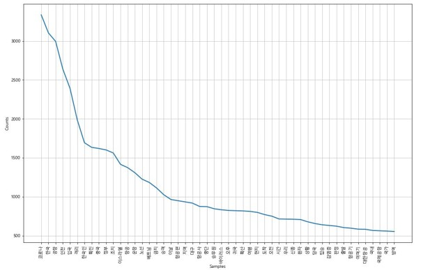

[2020]

#### 6.2 빈도수 높은 100개 단어, WordCloud로 나타내기

```python
from wordcloud import WordCloud

wc = text.vocab().most_common(100)

wordcloud = WordCloud(font_path='c:/Windows/Fonts/malgun.ttf',
                      relative_scaling = 0.2,
                      #stopwords=STOPWORDS,
                      background_color='white',
                      ).generate_from_frequencies(dict(wc))
plt.figure(figsize=(16,8))
plt.imshow(wordcloud)
plt.axis("off")
plt.show()
```

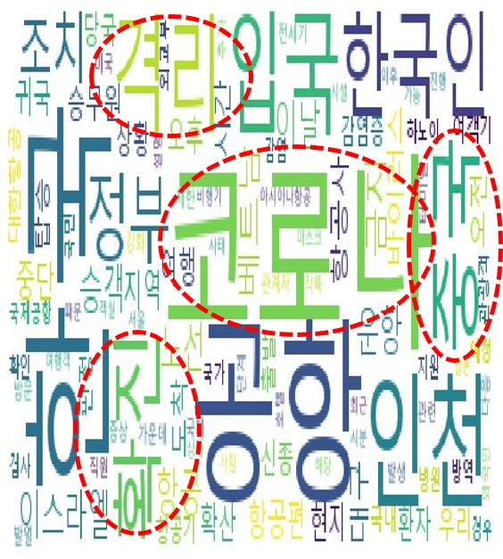

위의 워드클라우드로 시각해 본 결과,

코로나, 공항,중국, 확진, 격리 등의 키워드가 현저히 높은 빈도수를 차지한다.

 Word Cloud에서도 한눈에 띄며, 그 외에도 한국, 조치, 귀국, 입국등 코로나 사태에 대한 내용의 단

어들이 보인다. 


#### 6.3 Gensim을 이용한 토픽모델링 : LDA

```python
#gensim 모듈 
from gensim import corpora
from gensim import models 
```


##### corpus , dictionary생성

```python
#문서-단어 행렬(DTM) 만들기위한 corpus 만들기
#어휘 학습
dictionary = corpora.Dictionary(token_list)

corpus = [dictionary.doc2bow(text) for text in token_list]

print(dictionary[3]) #7601개의 고유 단어 토큰의 정수 인코딩된 값
print(corpus[0]) #DTM : (고유 단어 토큰의 빈도수)
```

LDA의 parameter값으로 DTM(Document-Term-Matrix)가 들어가기 때문에 우선 DTM을 생성하기위한 코퍼스를 생성해주어야 한다.


```python
NUM_TOPICS = 10 #토픽 갯수, k=3

NUM_TOPIC_WORDS = 10 #토픽당 해당 단어 갯수

#DTM 생성 함수
def build_doc_term_mat(documents):
    print("Building DTM..")
    
    dictionary = corpora.Dictionary(documents)
    corpus = [dictionary.doc2bow(text) for text in documents]
    
    return corpus , dictionary

#모델 생성 함수   
def print_topic_words(model):
    print("Printing Topic Words..")
    
    for topic_id in range(model.num_topics):
        topic_word_probs = model.show_topic(topic_id , NUM_TOPIC_WORDS)
        print("Topic ID : {}".format(topic_id))
        
        for topic_word, prob in topic_word_probs:
            print("\t{}\t{}".format(topic_word, prob))
            
        print("\n")
```

LDA 모델을 만들때 토픽 개수 K를 정하는 것은 상당히 중요한 작업이다. 데이터 수가 많은건 아니었기 때문에 토픽 10개가 성능이 가장 잘나왔기 때문에 k=10으로 설정하였다.

 

 ##### LDA Model 훈련시키기

``` python
import gensim #topic 10>20>15

#DTM
corpus , dictionary = build_doc_term_mat(token_list)

#LDA 훈련시키기
model = models.ldamodel.LdaModel(corpus , num_topics=NUM_TOPICS, id2word=dictionary, alpha="auto", eta="auto", passes=100)
print_topic_words(model)

ldamodel = gensim.models.ldamodel.LdaModel(corpus , num_topics=NUM_TOPICS, id2word=dictionary, alpha="auto", eta="auto", passes=100)
topics=ldamodel.print_topics(num_words=4) #상위 4개 단어들의 해당 토픽에 대한 기여도

for topic in topics:
    print(topic)
```


#### LDA Model 성능평가

<평가 지표>

1) Perplexity (혼란도)

* Perplexity값이 작으면 토픽모델이 문서를 잘 반영
* 특정 확률모델이 실제로 관측된 값을 얼마나 잘 예측하는지 뜻한다.

2) Coherence(주제 일관성)

* 해당 토픽모델이 모델링이 잘 될 수록 한 주제 안에는 의미론적으로 유사한 단어가 많이 모여있다는 것이다.

* 주제 일관성이 너무 높으면 해당 기사가 너무 단조롭다는 의미, 너무 높으면 일관성이 없다. 즉, 분석의 의미가 낮다고 측정

* 0.5~0.7사이가 일관성 있는 모델이라고 평가

  ``` python
  from gensim.models import CoherenceModel
  
  lda_cs=CoherenceModel(model=ldamodel, texts=token_list, corpus=corpus, dictionary=dictionary, coherence="c_v").get_coherence() #coherence옵션: "C_v"
  
  print("Coherence score : %.4f" %lda_cs)
  ```

  **성능평가 결과 : 0.5453(약 0.55)로 성능이 꽤 괜찮은 토픽모델이 나왔다.**


 #### PyLDAvis package (시각화)

```python
import pyLDAvis
import pyLDAvis.gensim
```

```python
#pyLDAvis를 쥬피터에서 사용할 수 있도록 활성화
pyLDAvis.enable_notebook()
vis= pyLDAvis.gensim.prepare(ldamodel, corpus , dictionary)
pyLDAvis.display(vis)
```

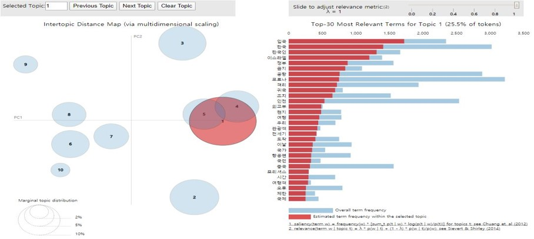


#### Airportal에서 가져온 "공항별 운항 현황 데이터" 탐색

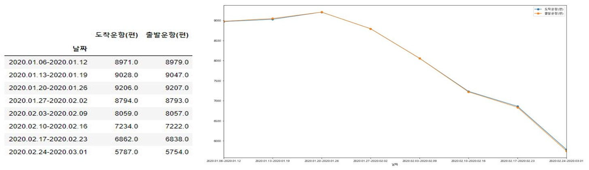

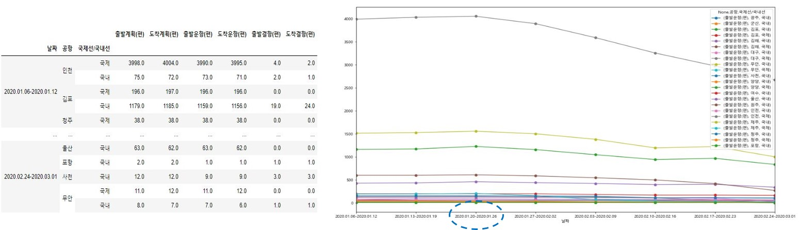

데이터를 시각화하기 좋게 Pandas로 재구조화 시켜주었다.


첫번째 시각화) 

 날짜에 따른 도착운항(편)/ 출발운항(편)의 횟수를 시각해보았을때, 처음 국내 코로나 확진 날짜인 1/22이후 급격

히 하락하는 모습을 볼 수 있다. 또한 3월 1일 기준으로 1월6일(1월 초 ) 보다 약 1.56배 가량 감소하였다.


두번째 시각화)

날짜에 따른 공항별 도착운항(편)/ 출발운항(편) 횟수를 시각해 보았을때, 국제선이 많은 인천공항의 운항 횟수가

급격히 하락했음을 확인할 수 있다.


### Part7.  프로젝트 결과


각 시기별(1주 기준) 토픽에 속하는 확률값이 높은 상위 10개의 단어들을 뽑아 보고 , 높은 확률 값을 가진 단어들의 집합들을 가지고 토픽을 정의해 보았다.

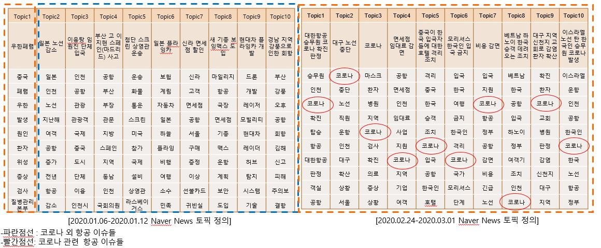

그 중 가장 비교를 한눈에 볼 수 있는 1월초(2020.01.06-2020.01.12)의 토픽모델링 결과와 3월초[2020.02.24-2020.03.01] 의 토픽 모델링 결과를 비교해 보았다.

##### 1월초(2020.01.06-2020.01.12)의 토픽모델링 결과

Topic1 에 속할 확률이 높은 단어들:  "중국" "페렴" "우한" "발생" "원인" "환자" "위성" "증상" "검사" "질병관리 본부" 

.

.

위와 같은 단어들의 조합을 가지고 토픽을 정의해보면 Topic1은 "우한페렴"이라고 정의해 볼 수 있었다.

이와 같은 방법으로 모든 토픽들을 정의해보았다. 


결론>

1월초(2020.01.06-2020.01.12) 항공뉴스기사에 코로나 관련 토픽이 1개가 확인되었으며, 약 2달 후 3월초

(2020.02.24-2020.03.01) 항공뉴스기사의 모든 토픽들은 코로나 관련 기사라는 것을 확인할 수 있었다.

또한, 항공 뉴스기사에서 코로나 관련 키워드가 나오는 시점을 보았을때 항공 운항 현황이 떨어지는 시점과 유사하

다고 볼수 있다.

