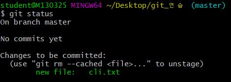

## Git 2nd Class 

### 1. Git 이란?


>  리누스 토르발스에 의해 만들어진 분산형 버전 관리 시스템.  Git은 개인적으로 운영할 수도 있지만 거의 대부
>
> 분 원격 서버와 연계해서 협업을 하며 사용합니다.

> * Github:  원격저장소(Local Repository) 역할을 해주는 서비스 
> * 그 외 Gitlab, Bitbucket등이 있다.

### 1-1. Git 동작 원리

-Working Directory: 저장공간

-Staging Area : "git add" 명령어를 통해 파일들을 저장. commit 대상들. 

 -Local Respository (version) : "git commit"명령어를 통해 로컬 저장소로 보낸다.


### 2. git 새 저장소 만들기_review 

##### 1) init / add

```bash
touch test.txt # 텍스트 파일 생성 

** git status #push 하기 전 Staging Area에 있는 git 상태 확인

```



> untracked file~ :트래킹 되고 있지 않은 파일들. git으로 버전을 남긴적이 없는 파일.

```bash
ls # 파일 내역 확인

git init 

git add . #파일을 ㅉorking Directory 저장공간에 넣기.
* git add a.txt 
* git add myfolder/ 
```


##### 2) commit 

``` bash
git commit -m "Init" #Init이라는 커밋메세지와 함께 Staging Area에 커밋 대상으로 옮김.

git log # 커밋 이력을 확인
* git log -1 # 최근 한개 커밋
* git log --online # 간략한 로그
* git log online -l # 최근 한개의 커밋을 간략하기.

* git config 나의 이메일 주소


```

```bash
git restore "파일" #commit된 파일을 되돌릴 수 있다. 
```

>  하지만 staging area (add를 한 상태)에 없는 상태라면 복구가 안된다.


##### 3) Push

``` bash
git push origin master
```

> * 현재 폴더를 그대로 업로드 하는 것이 아니라, 지금까지의 이력/버전(commit)을 push하는 것.
>
> * Working Directory, Staging area의 변경사항들을 원격 저장소로 push되지 않는다.
> * 따라서 ,  push전에  $git status, $git log를 습관화 한다.


### 3. Github 활용

##### 1) 원격저장소 설정

```bash
git remote add origin {__url__} #원격 저장소로 origin 이름으로 url을 추가
```

##### 2)원격 저장소 목록

``` bash
git remote -v
```

##### 3) 원격 저장소 삭제

``` bash
git remote rm origin #origin 이름의 원격 저장소 설정을 삭제
```

##### 4) 원격 저장소에서 local로 가져오기  ***

* 타 local에서 원격 저장소에서 가져오기 (최초 한번만)

  ```bash
  git clone http://~ #내가 가져올 폴더의 url 입력 , 그 후 add-commit-push 작업 가능 
  ```

* 내 local에서 원격저장소에 있는 파일 가져오기. ( pull 명령어 시작 후 협업 작업 가능)

``` bash
git pull origin master #원격 저장소 변경사항(이력)가져오기. 
```

##### 5) 공유가 될 필요가 없는 파일

``` bash
git ignore
```


### 4. Vi(Vim)

CLI 환경에서 쓸수 있는 텍스트 에디터 중 하나이며,  commit 하는 과정에서 메세지 옵션을 쓰지 않으면 나타난다.

``` bash
git commit
```

> * i   : 텍스트 편집 모드
> * esc + :wq  :편집기 나가기