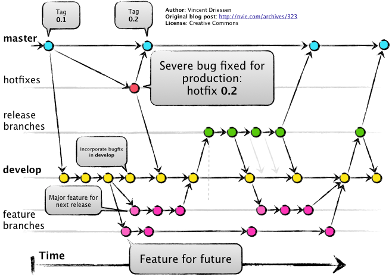
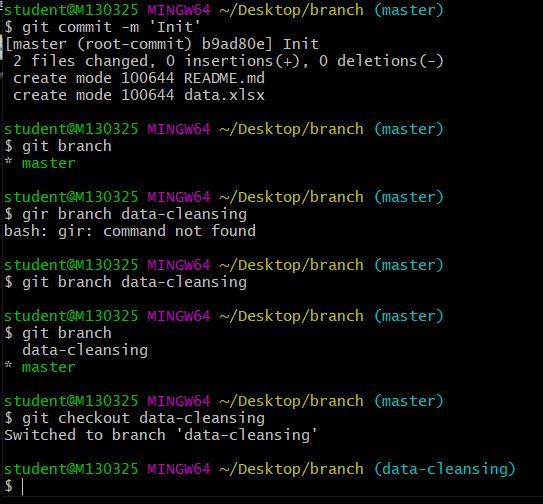

# Git 3rd Class

### 1) Github Portfolio Page 관리

Markdown을 html, css, js로 변환해주는 기능.

* Jekyll - Ruby 기반 , 오래되고 유명함
* Gatsby - JS 기반, 최근 등장했고 매우 유명함
* Hexo - vue 기반

*카카오 기술 블로그 참고: [Tech kakao](https://tech.kakao.com/)

#### Git  Branch Flow




### 2) Branch

> branch 기능은 서로 다른 독립된 작업이력을 관리할 수 있도록 한다.

#### 기초 명령어

1. branch 생성

```bash
$ git branch {브랜치 이름}
```

2. branch 이동

``` bash
(master) $ git checkout {브랜치 이름}
(브랜치이름) #이동후 변경 됨


(master) $ git checkout -b {브랜치 이름} #생성 및 이동
```

3. branch 목록

``` bash
(master) $ git branch
```

4. branch 병합 

``` bash
(master) $ git merge {브랜치 이름}
```

5. branch 삭제 

```bash
$ git branch -d {브랜치 이름}
```




### 3) Stash 

> 작업 내역을  저장할 수 있는 공간이 있다.

1. stash 보관

``` bash
$ git stash
```

2. stash 반영

``` bash
$ git stash pop
```

3. stash 목록

``` bash
$ git stash list
```


##### 상황

> git은 commit되지 않은 변경사항에 대해서는 되돌릴 수 없다.
>
> 따라서. 작업 내역이 있을때 (WD/ Staging area 상태인 작업) 병합 과정이 진행되지 않는다.

``` bash
$ git pull origin master

remote: Enumerating objects: 6, done.
remote: Counting objects: 100% (6/6), done.
remote: Compressing objects: 100% (3/3), done.
remote: Total 4 (delta 0), reused 3 (delta 0), pack-reused 0
Unpacking objects: 100% (4/4), done.
From https://github.com/edutak/1001-ai
 * branch            master     -> FETCH_HEAD
   38ea6fa..64e06b8  master     -> origin/master

# pull 내용을 받아오면, 지금 로컬 변경사항 중 다음 파일이 덮어씌여질 것이다.
error: Your local changes to the following files would be overwritten by merge:
        README.md
# 커밋을 하거나
# stash를 해라.
Please commit your changes or stash them before you merge.
Aborting
Updating 38ea6fa..64e06b8
```

##### 해결과정

```bash
student@M1303 MINGW64 ~/Desktop/백일장 (master)
$ git stash
Saved working directory and index state WIP on master: 38ea6fa Init

student@M1303 MINGW64 ~/Desktop/백일장 (master)
$ git stash list
stash@{0}: WIP on master: 38ea6fa Init

student@M1303 MINGW64 ~/Desktop/백일장 (master)
$ git pull origin master
From https://github.com/edutak/1001-ai
 * branch            master     -> FETCH_HEAD
Updating 38ea6fa..64e06b8
Fast-forward
 README.md | 22 +++++++++++-----------
 1 file changed, 11 insertions(+), 11 deletions(-)

student@M1303 MINGW64 ~/Desktop/백일장 (master)
$ git stash pop
Auto-merging README.md
CONFLICT (content): Merge conflict in README.md
The stash entry is kept in case you need it again.
```


### 4) 명령어 취소 및 되돌리기

1.  `add` 취소

``` bash
$ git restore --staged {파일명}
```

* add 명령을 취소하는 작업

* Staging Area -> Working directory 로 이동

* 구버전 명령어

  ``` bash
  $ git reset HEAD {파일명}
  ```

2. 커밋 메세지 변경

   ***주의할 점: 커밋 해시값이 바뀜으로, push 한 이후에는 절대 하면 안됨.

   ```bash
   git commit --amend
   ```

   * vim 편집기 창에서 직접 메세지를 수정하고, 저장 (:wq) 하면 완료

3.  커밋 변경

   * 만약, 특정 파일을 추가하지 못한 상태로 커밋을 하였다면 파일을 지정해서 커밋 가능.

     ``` bash
     $ git add omit_file.txt #선택파일
     $ git commit --amend 
     #역시, 커밋 해시값이 변경되기 때문에 Push 한 이후에 절대 하면 안됨.
     ```

4.  working directory 변경사항 삭제

   *** restore명령어를 사용하면 절대 되살릴 수 없으니 주의!

   ``` bash
   $ git restore {파일명}
   
   #구버전
   $ git checkout -- {파일명}
   ```

5.  reset vs revert

   * 두 명령어는 특정 시점의 상태로 이력(커밋)을 되돌리는 작업을 한다.

   * reset : 이력을 삭제

     * `--hard` : 해당 커밋 이후 변경사항 모두 삭제 (주의)
     * `--soft`: 해당 커밋 이휴 변경사항 및 wd 내용까지 보관
     * `--mixed` : (default) 해당 커밋 이후 변경사항 staging area 보관

     ```bash
     $ git log --oneline
     a70327e (HEAD -> master, origin/master) Update a.txt
     41a723a Init
     ```

   * revert : 되돌렸다는 이력을 남긴다.

     ```bash
     $ git log --oneline
     1cd8c64 (HEAD -> master) Revert "Update a.txt"
     b696a08 Complete a, b
     c02b94a R
     a70327e (origin/master) Update a.txt
     41a723a Init
     ```

     