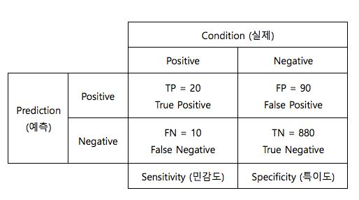

### 앙상블 

#### 1. 취합 방법론: 사용할 모형의 집합이 이미 결정되어 있음.

* Voting
* Bagging
* Random Forest : rn개의 서로 조금 다른 Decision Tree들의 결합된 알고리즘. n개의 Decision Tree들의 결정 경계와 예측한 확률을 평균 내어 만든다. 

#### 2. 부스팅 방법론: 사용할 모형을 계속해서 늘려가는 방법

* AdaBoost
* Gradient Boost

### 평가점수

confusion matrix 로부터 평가점수를 계산

-정확도, 정밀도, 민감도, 재현율, F-score, 위양성률

* Accuracy(정확도) : (TP+TN)/Total = 20+880 / 1000= 90%

* Precision(정밀도):  양성으로 예측한것 중 실제 Positive(양성)인 비율 TP/(TP+FP) 

* Sensitivity(민감도): 실제 Positive(양성) 중에서 Positive(양성)라고 예측한 비율=> TPR

  TP/(TP+FN) = 20/(20+10) = 66.7%

  =Recall(재현율) : 민감도와 같다.

  

* Specificity(특이도): 실제 Negative중 Negative라고 예측한 비율

  TN / (FP+TN) =880/(90+880)=90.7%

  

  * 1-특이도 : 실제 Negative , 예측 Positive 으로 잘못 예측 비율 =>  FPR

    Roc Curve :TPR 과 FPR

    *TPR은 1에 가까울수록 , FPR을 0에 가까울수록
  
    

  ex) FDS(Fraud Dectection System: 사기거래 발견시스템)
  
  -사기거래 : 양성
  
  -정상거래: 음성
  
  TP: 사기거래를 사기거래라고 예측
  
  FP: 정상거래를 사기거래라고 예측
  
  FN: 사기거래를 정상거래라고 예측
  
  TN: 정상거래를 정상거래라고 예측

