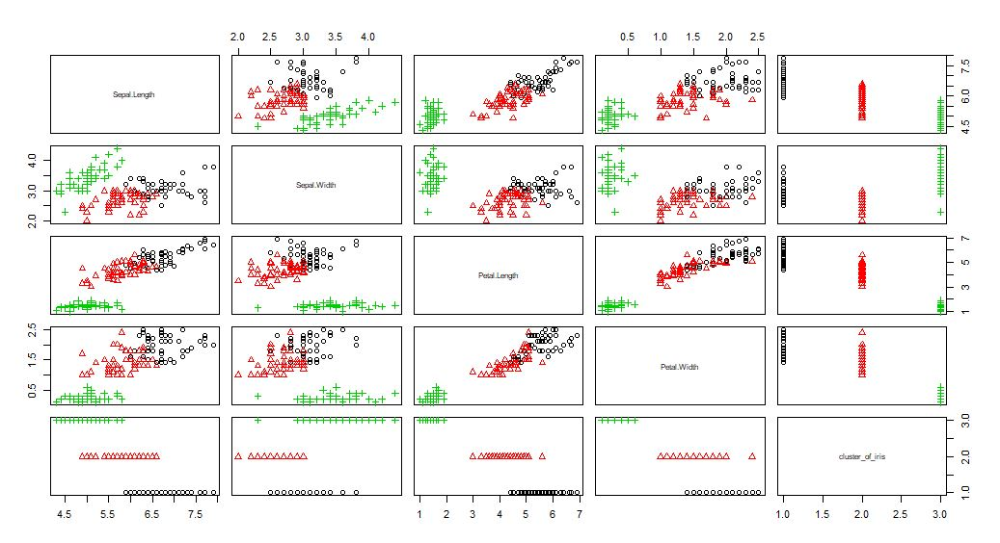

## 연관분석 : Apriori Algorism

```R
#"arules" package 사용
library(arules)
data("Epub")
summary(Epub)
itemFrequency(Epub[,1:10])
itemFrequencyPlot(Epub, support=0.001, topN=20, main="item frequency")

image(sample(Epub,500))

EpubRules<-apriori(Epub, parameter = list(support=0.001, confidence=0.2, minlen=2))
EpubRules<-sort(EpubRules, by="lift")[1:20]
summary(EpubRules)
inspect(EpubRules)

#%in%은 적이도 하나의 제품이 존재하면 해당 규칙을 가져옴
#원하는 항목만 뽑아서 볼때
rule_ins<-subset(EpubRules, items %in% c("doc_72f", "doc_4ac"))
inspect(rule_ins)

#원하는 항목(lhs)만 뽑아서 볼때
rule_ins<-subset(EpubRules, lhs %in% c("doc_72f", "doc_4ac")) 
inspect(rule_ins)

#%pin%은 지정 문자열이 들어있는 항목 이름 출력
rule_ins<-subset(EpubRules, items %pin% c("60e"))
inspect(rule_ins)

#%ain%은 지정 전체 문자열이 들어있는 항목 이름 출력
rule_ins<-subset(EpubRules, items %ain% c("doc_6e8", "doc_6e9"))
inspect(rule_ins)

rule_ins<-subset(EpubRules, items %pin% c("60e") & confidence>0.25)
inspect(rule_ins)

#시각화 
library(arulesViz)
library(igraph)
plot(sort(EpubRules, by="lift"), method="grouped") 
#원크기: support에 비례해서 커진다.
#색깔: lift에 비례해서 진해진다.

plot(EpubRules, method="graph", control = list(type="items"),
     vertex.label.cex=0.7, edge.arrow.size=0.3, edge.arrow.width=2) 
#vertex.label.cex: 점크기
#edge: 화살표(선) edge.arrow:lhd->rhd방향으로 화살표
```


## Clustering: K-means Algorism

```R
teens<-read.csv("Data/snsdata.csv")
summary(teens)
str(teens)
table(teens$gender, useNA = "ifany") #남/여 수, NA값 갯수까지 출력

summary(teens$age) #각 컬럼(feature)별 통계치+NA갯수

#이상치를 NA로 변환(정상범위: 13<=age<20로 지정)
teens$age<-ifelse(teens$age>=13 & teens$age<20, teens$age, NA)
summary(teens$age)

#여성이면서 NA가 아닌 얘들 1,아니면 0으로 변환
teens$female<-ifelse(teens$gender=="F" & !is.na(teens$gender),1,0)
table(teens$female) #0: 남자 혹은 NA

teens$no_gender<-ifelse(is.na(teens$gender),1,0)
table(teens$gender, useNA="ifany") 
#  F     M    <NA> 
#22054 5222  2724 

mean(teens$age, na.rm=TRUE)

#그룹(졸업연도)별로 평균 계산
myagg<-aggregate(data=teens, age~gradyear, mean, na.rm=TRUE)
myagg

avg_age<-ave(teens$age, teens$gradyear, FUN = function(x) mean(x, na.rm=TRUE))
avg_age

teens$age<-ifelse(is.na(teens$age),avg_age,teens$age)

interests<-teens[5:40]
set.seed(2345) 
interests_z<-as.data.frame(lapply(interests, scale,)) #표준화 
interests_z
teen_clusters<-kmeans(interests_z,5)
teen_clusters$size 
teen_clusters$centers #각 feature별 각 cluster의 중심지점

teens$cluster<-teen_clusters$cluster
teens[1:5,c("cluster","gender","age","friends")]

#클러스터 집단(기준)별 나이평균
aggregate(data=teens, age~cluster, mean)

#클러스터 집단별 여성 비율
aggregate(data=teens, female~cluster, mean)
```

### *iris data를 이용한 K-means Clustering

```R
iris
iris_z<-as.data.frame(lapply(iris[1:4], scale, )) #표준화
set.seed(2345)
iris_cluster<-kmeans(iris_z,3) #3개로 군집화
iris_cluster$size # 각 군집별 갯수 47,53,30
iris_cluster$centers #각 feature별 각 cluster(3개)의 중심지점

iris$cluster_of_iris<-iris_cluster$cluster
iris #setosa만 Sepal.Length Sepal.Width Petal.Length Petal.Width 가 비슷함.

#시각화
plot(iris[-5], pch=iris_cluster$cluster, col=iris_cluster$cluster) 

# 각 feature(Sepal.Length Sepal.Width Petal.Length Petal.Width)별 3개 cluster의 분포 시각화


```

