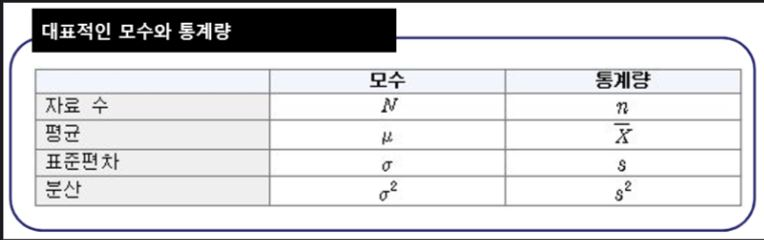
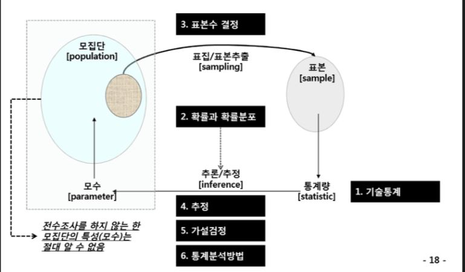

## Day 13

### 기초 통계 

#### 모집단과 표본

* 모집단(Population): 전체 집단

* 모수(Parameter): 모집단(Population)의 특성

* 표본(sample): 모집단에서 추출한 sampling한 대상

* 통계량 : 해당 모집단에서 추출한 표본들의 함수

* 표본분포:  통계량의 확률분포

  모집단이 어떤 특정한 분포를 따르고 있을때 n개의 표본을 추출했다면 표본들은 모집단의 확률분포에 기반하여 추출한것.

  

  평균이 μ 고 분산이 σ2 인 정규 모집단에서 n개의 표본을 뽑았다고 하면, 표본평균 X 는 정규확률샘플들의 선형 결합이고 정규분포를 따른다고 할수 있다.




#### 기술통계와 추론통계

* 기술통계: 수집된 데이터를 요약하고 기술
* 추론통계: 수집된 데이터를 근거로 모집단의 특성을 일반화 하는것.



#### 

#### 조건부 확률

```
사건 A,B가 독립
P(A|B) = P(A) 또는 P(B|A) = P(B) 
P(A,B) = P(A)P(B)

사건 A,B가 종속
P(A|B) = P(A,B) / P(B) 또는 P(B|A) = P(B,A) / P(A)
```


#### 이산형 확률 분포

1) 이항분포

확률변수가 배타적인 두 변수를 갖고, 각 시행을 독립적으로 할 경우 : 베르누이시행이라고도 한다. 독립시행이란 이전 시행이 다음 시행의 확률에 영향을 주지 않는 경우는 뜻한다. 예를 들면 주사위 5번 던지므로 n=5이지만 1일이 나올 확률은 동일하게 1/6 이다. 

nCk= n! / k!(n-k)!

+베르누이 확률분포

결과가 2개만 나오는 경우 ex) 동전 던지기, 시험의 합격/불합격

f(x)= p^x*(1−p)^n−x

E[X] (평균)=np 

V[X] (분산)=np(1−p)


2)  다항분포 

다항분포는 이항분포의 확장이며, 확률변수가 가질수 있는 범주가 n개 있는 분포

각 범주의 조합을 곱해서 해당 확률을 구한다.

(첫범주확률)^첫범주갯수×(다음범주확률)^다음범주갯수×⋯×(마지막범주확률)^마지막범주갯수


3) 포아송 분포

일정단위에서 평균성공횟수가 m일때 성공횟수를 확률변수로 하는 분포.

대표적인 사례>

* 10시에서 11시 사이에 xx은행에 방문한 고객의 수
* 남부고속도로에서 2시에서 3시 사이에 톨게이트를 통과하는 차량의 수
* 1년 동안 특정 진도 이상의 지진 발생 횟수

이항분포를 따르는 분포에서 시행횟수 n이 아주 커지고, P가 아주 작을 경우, 이항분포는 포아송분포로 근사시킬수 있다.


4)기하 분포

성공확률이 P인 베르누이 시행에서 첫번째 성공이 있기 까지 x번 실패할 확률


#### 연속형 확률 분포 ( 정규분포 )

1) 정규분포

평균 μ , 분산 σ2 ,  표준편차 σ 인 x의 확률밀도 함수

표준편차가 클 수록 퍼저 보이는 그래프가 나타난다.


+표준정규분포

표준정규분포는 정규분포에서 평균이 0, 분산 1 인 경우, 가설 검정에서 많이 쓰인다.


*중심극한정리

중심극한정리는 동일한 확률분포를 가진 독립확률변수 n개의 평균의 분포는 n이 적당히 크다면 정규분포에 가까워진다는 정리이다.

즉, 표본의 크기가 커질수록 표본평균은 모집단의 평균에 가까워진다는 의미.


2) 지수 분포

어떤 사건이 발생할 때 까지 경과한 시간에 대한 연속확룰분포


3) 카이제곱 분포 

-p개의 서로 독립적인 표준정규 확률변수를 각각 제곱한 다음에 합해서 얻어지는 분포이다.

-두 집단간의 동질성 검정에 활용.

-확률변수 X가 표준정규분포(Z)를 따를 때 , 자유도가 k인 카이제곱분포를 따른다.

*자유도(df)=(r-1)(c-1) / r:행의 개수 / c : 열의 개수


4) 감마 분포

a번쨰 사건이 발생할 때까지의 대기시간의 분포


5) t-분포

-표준정규분포와 같이 평균이 0을 중심으로 좌우가 동일한 분포

-두 집단의 평균이 동일한지 알고자 할때


6) F-분포

-두 집단간 분산의 동일성 검정에 사용되는 검정 통계량 분포


### Liner Regression(선형회귀)

```R
#종속변수가 정규성을 따르면 모델의 적합도가 높아짐
insurance<-read.csv("Data/insurance.csv")
str(insurance)
summary(insurance)
summary(insurance$expenses)


#히스토그램으로 확인하면 왼쪽으로 치우친 모양을 볼수 있다.
#정규성을 띄진 않으므로 적절한 모델은 아니다.
hist(insurance$expenses) 
```


```R
#변수간의 상관관계 확인
cor(insurance[c("age","bmi","children","expenses")])

#상관관계 시각화
pairs(insurance[c("age","bmi","children","expenses")])

install.packages("psych")
library(psych)
pairs.panels(insurance[c("age","bmi","children","expenses")])
```

```R
#모델생성
ins_model<-lm(expenses~.,data=insurance)
summary(ins_model)
```


#### >결과 및 해석

```R
#Coefficients:
#Estimate Std. Error t value Pr(>|t|)    
#(Intercept)     -11941.6      987.8 -12.089  < 2e-16 ***
#  age                256.8       11.9  21.586  < 2e-16 ***
#  sexmale           -131.3      332.9  -0.395 0.693255    
#bmi                339.3       28.6  11.864  < 2e-16 ***
#  children           475.7      137.8   3.452 0.000574 ***
#  smokeryes        23847.5      413.1  57.723  < 2e-16 ***
#  regionnorthwest   -352.8      476.3  -0.741 0.458976    
#regionsoutheast  -1035.6      478.7  -2.163 0.030685 *  
#  regionsouthwest   -959.3      477.9  -2.007 0.044921 *  
 # ---
#  Signif. codes:  0 ‘***’ 0.001 ‘**’ 0.01 ‘*’ 0.05 ‘.’ 0.1 ‘ ’ 1

#Residual standard error: 6062 on 1329 degrees of freedom
#Multiple R-squared:  0.7509,	Adjusted R-squared:  0.7494 
#F-statistic: 500.9 on 8 and 1329 DF,  p-value: < 2.2e-16


1) 위의 분석결과는 expenses를 종속변수로 예측하기 위해 expense를 제외한 모든 독립변수를 활용하여 모형이 설계되었음을 확인할 수 있다.  
귀무가설: age, bmi, children 모두 0
대립가설: 적어도 하나의 독립변수는 0이 아니다.

F-통게량은 500.9 이며 p-value의 값은 2.2e-16이므로 귀무가설의 기각역인 0.05보다 훨씬 작으므로 대립가설을 채택한다.

2) 각 독립변수에 대한 통계적 타당성을 보면 
첫번째 변수인 age에 대한 통계적 가설을 세운다.
귀무가설: age = 0
대립가설: age != 0
age 변수의 P-value값은 2e-16이므로 대립가설 채택, 유의한 변수이다.
.
.
.
각 독립변수들도 동일한 방법으로 유의성 확인

3) 통계적으로 유의성을 확인한 후 회귀모형이 얼마나 전체 데이터를 잘 설명하는지 확인하기 위해 R^2 계수를 확인한다.
둘다 Multiple R-squared:  0.7509,	Adjusted R-squared:  0.7494 이며
이는 전체데이터를 약 75%를 설명하고 있다고 볼수 있다.

4) 최종적으로 회귀식은 expense=-11941.6+256*age-131.3*sexmale+339.3*bmi+475.7*children+23847.5*smokeyes+(-352.8*regionnorthwest)+(-1035.6*regionsoutheast)+(-959.3*regionwest)이다. 
결론은 expenses에 가장 영향을 끼치는 변수는 smokeyes이다.

```


