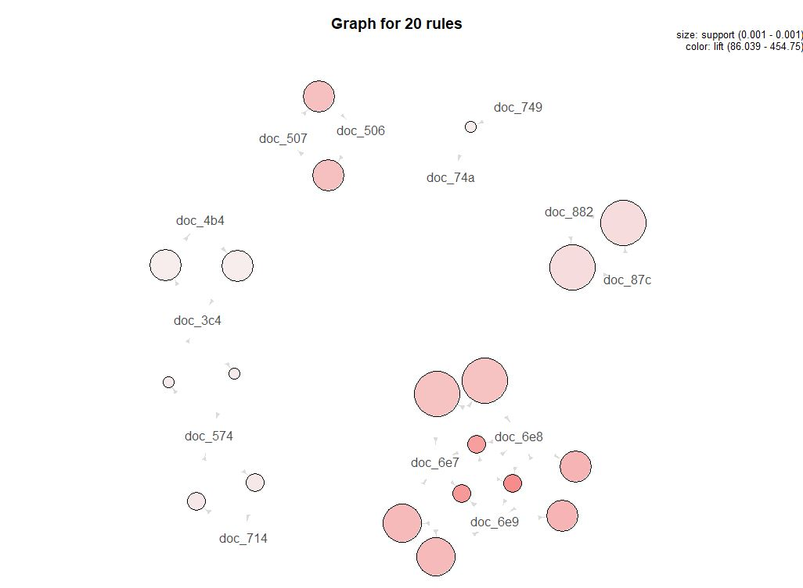

## 연관분석 : Apriori Algorism

```R
#"arules" package 사용
library(arules)
data("Epub")
summary(Epub)
itemFrequency(Epub[,1:10])
itemFrequencyPlot(Epub, support=0.001, topN=20, main="item frequency")

image(sample(Epub,500))

EpubRules<-apriori(Epub, parameter = list(support=0.001, confidence=0.2, minlen=2))
EpubRules<-sort(EpubRules, by="lift")[1:20]
summary(EpubRules)
inspect(EpubRules)

#%in%은 적이도 하나의 제품이 존재하면 해당 규칙을 가져옴
#원하는 항목만 뽑아서 볼때
rule_ins<-subset(EpubRules, items %in% c("doc_72f", "doc_4ac"))
inspect(rule_ins)

#원하는 항목(lhs)만 뽑아서 볼때
rule_ins<-subset(EpubRules, lhs %in% c("doc_72f", "doc_4ac")) 
inspect(rule_ins)

#%pin%은 지정 문자열이 들어있는 항목 이름 출력
rule_ins<-subset(EpubRules, items %pin% c("60e"))
inspect(rule_ins)

#%ain%은 지정 전체 문자열이 들어있는 항목 이름 출력
rule_ins<-subset(EpubRules, items %ain% c("doc_6e8", "doc_6e9"))
inspect(rule_ins)

rule_ins<-subset(EpubRules, items %pin% c("60e") & confidence>0.25)
inspect(rule_ins)

#시각화 
library(arulesViz)
library(igraph)
plot(sort(EpubRules, by="lift"), method="grouped") 
#원크기: support에 비례해서 커진다.
#색깔: lift에 비례해서 진해진다.

plot(EpubRules, method="graph", control = list(type="items"),
     vertex.label.cex=0.7, edge.arrow.size=0.3, edge.arrow.width=2) 
#vertex.label.cex: 점크기
#edge: 화살표(선) edge.arrow:lhd->rhd방향으로 화살표
```

